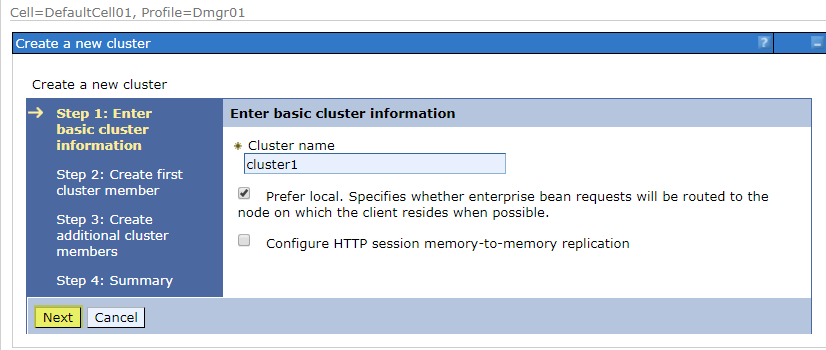

# Websphere Application Server Network Deployment 8.5.5.x 2-Node Cluster on Docker

Referrence to [Amir Barkal's Websphere Application Server Network Deployment 2-Node Cluster on Docker](https://github.com/amirbarkal/websphere-nd-docker.git) and [IBM official Dockerfiles for WebSphere Application Server traditional](https://github.com/WASdev/ci.docker.websphere-traditional)

======================================================================================================
## What is this?

This is a bunch of dockerfiles and docker-compose yaml files to get you started quickly with WebSphere Application Server Network Deployment 8.5.5.x cluster.
The purpose of this project is to easily create a 2 node cluster with a custom WAS profile, running on 3 Docker containers:
* Deployment Manager (dmgr)
* Custom node 1 running an application server (custom1)
* Custom node 2 running an application server (custom2)

NOTE: At the moment the cluster needs to be manually created from ISC, after the
  cell has been initialized.

## What is it good for?
Testing, demonstration, learning and POC. Witnessing the AWESOME power of Docker!

## Prerequisites:
* Git-Bash with Administrator privileges. It will be used to clone this repository, and as a shell to run docker CLI. 
* Docker-tools with minimum engine version 1.12.0

## How do I run it?
1. Clone this repo `https://github.com/hxf0801/wasnd855-docker.git`
2. Change to the repo dir `cd wasnd855-docker`
3. Go to Directory `install` to build an WebSphere Application Server Network Deployment traditional Docker image. And then go back here. 
    > Refer to [the detailed steps](README_StepByStep.md) to find out more on **_`Build an IBM WebSphere Application Server Network Deployment traditional image`_**.
4. Execute `docker-compose up -d`.
    > Refer to [the detailed steps](README_StepByStep.md) for **_Build an IBM WebSphere Application Server Network Deployment traditional deployment manager image_** and **_Build an IBM WebSphere Application Server Network Deployment traditional custom node image_**.
    
    > For specifing a compose file, execute `docker-compose -f docker-compose.centos7.yml up -d`. 

    > See logs, issue `docker-compose -f docker-compose.centos7.yml logs`.

    > See logs for certain service _custom2_, issue `docker-compose -f docker-compose.centos7.yml logs custom2`.

    > Export logs to a file named _log.txt_, issue `docker-compose -f docker-compose.centos7.yml logs > log.txt`
5. Wait for it... (Can take up to 20 minutes depending on the speed of your internet connection and CPU)
   > You can check containers status with `docker stats`. When CPU activity is around 0% your cluster is ready!
6. Manually create cluster
    * Access the ISC(**I**ntegrated **S**olution **C**onsole) and enter random username. (i.e. `wasadmin`)
      > Run `docker-machine ls` to find out the deployment manager's IP as `DOCKER_HOST`.

      > Open `http://DOCKER_HOST:9060/admin`. Security is off, so use whatever login name you like.

    * Create the cluster
      * Go to `Servers >> Clusters >> WebSphere application server clusters >> New`
    
      *  Enter cluster name, keep default options and hit `Next`
    
      * Add the first cluster member to node custom1, again keeping all default options and click `Next`
    
      * Add the second cluster member to node custom2 and click `Add Member`
    
      * Review the summary and hit `Finish`
    
      * Click `Review`
    
      * Make sure `Synchronize changes with Nodes` is selected and then click `Save`
    
      * Wait a while for configuration synchronization to complete before clicking `OK`
    
      * Start the cluster by selecting it from the list and hit `Start`
    
      * Wait for the 2 application server JVMs to load. You can check their status in 
    `Servers >> Server Types >> WebSphere application servers`. The column **Host Name** is the container id.
    

## To Do:
* Automate install application and setup env when creating custom node
* Automate cluster creation upon cell initialization

